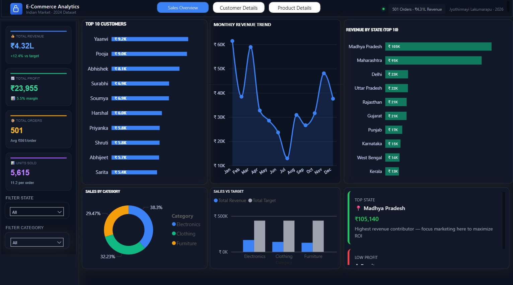
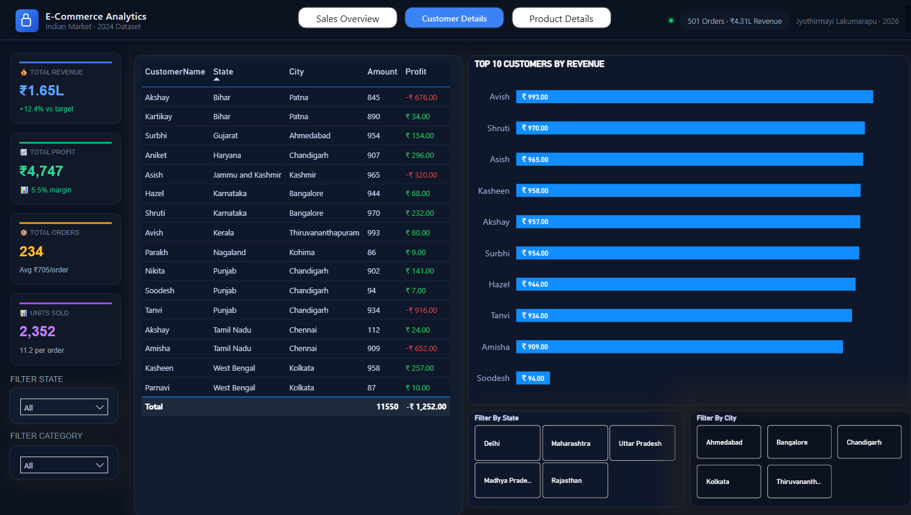
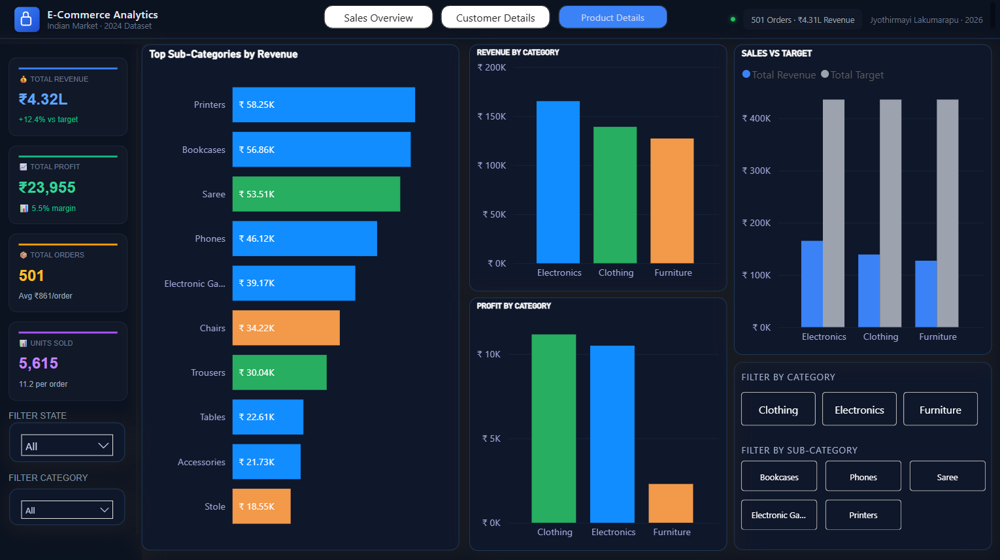

E-Commerce Sales Analysis — Advanced Power BI Dashboard with SQL & Excel

🚀 End-to-End Data Analytics Project | SQL + Power BI + Excel  
📊 Analyzed 500+ orders worth ₹4.31L across 20+ states to identify revenue drivers, customer behavior, and regional performance trends.

🔗 **[View GitHub Repository →](https://github.com/jyothirmayiL-insights/Ecommerce-sales-analysis)**

## 📸 Dashboard Preview
Interactive Power BI dashboard showcasing sales performance, customer insights, and product-level analytics.



## 📌 Project Overview

This project delivers an end-to-end analysis of an e-commerce dataset to identify key revenue drivers, customer behavior patterns, and product performance trends.
An interactive Power BI dashboard was developed to enable stakeholders to monitor KPIs, analyze business performance, and support data-driven decision-making.

---

## 🚀 Key Features

- Performed end-to-end data analysis using SQL, Excel, and Power BI  
- Developed an interactive dashboard with dynamic filtering using slicers and user controls  
- Designed custom KPI cards using HTML formatting to enhance visual presentation  
- Implemented Month-over-Month (MoM) revenue analysis using SQL queries  
- Conducted category-wise and state-wise performance analysis to identify key trends  
- Generated actionable business insights to support data-driven decision-making
  
---

## 🛠 Tools Used

- **SQL** – Data extraction, joins, aggregations, and analytical queries  
- **Excel** – Data cleaning, preprocessing, and exploratory analysis  
- **Power BI** – Data modeling, DAX measures, and interactive dashboard design
  
---

## ⚡ Advanced Features

- Developed advanced DAX measures to compute key performance metrics, including Revenue, Profit, and Profit Margin  
- Implemented Month-over-Month (MoM) growth analysis using DAX time intelligence functions  
- Designed custom KPI cards using HTML formatting to enhance visual presentation and user experience  
- Improved dashboard usability and aesthetics beyond standard Power BI visuals  
- Built interactive reports with dynamic filtering, enabling user-driven analysis and insights  

---

## 🎯 Business Problem

An Indian e-commerce company relied on static Excel reports, resulting in limited visibility into key performance metrics and delayed, data-driven decision-making.
The leadership team required a dynamic analytical solution to:

- Identify high-performing product categories driving overall revenue  
- Analyze state-wise and city-wise sales performance to uncover regional trends  
- Track monthly revenue against targets to monitor business growth  
- Identify high-value customers to support retention and loyalty strategies  

This project addresses these challenges by delivering an interactive Power BI dashboard supported by SQL-based analysis.

---

## 📊 Dashboard Pages

### 📈 Sales Overview


### 👥 Customer Analysis


### 📦 Product Analysis


---

## 💡 Key Insights

- 📍 Maharashtra and Madhya Pradesh together contribute approximately 46% of total revenue, indicating strong market concentration in these regions  
- 📦 Electronics category is the primary revenue driver, contributing around 38% of overall sales  
- 👕 Clothing category delivers the highest profit margin (~8%), highlighting strong profitability potential  
- 📉 July recorded the lowest sales, suggesting potential seasonal demand fluctuations  
- 👥 Top 10 customers contribute approximately 21% of total revenue, indicating opportunities for targeted retention strategies  

---

## 📈 Business Impact

- Enabled identification of high-performing regions and product categories for focused business strategies  
- Supported optimization of marketing campaigns and inventory planning based on sales trends  
- Improved customer targeting and retention through identification of high-value customers  
- Facilitated data-driven decision-making through an interactive and insightful dashboard  


## 📁 Folder Structure

```
p1_ecommerce/
├── data/
│   ├── List_of_Orders.csv
│   ├── Order_Details.csv
│   └── Sales_Target.csv
├── sql/
│   ├── 01_fact_orders.sql
│   ├── 02_dim_customer.sql
│   ├── 03_dim_product.sql
│   ├── 04_dim_calendar.sql
│   └── 05_business_queries.sql
├── dashboard/
│   └── Ecommerce_Dashboard.pbix
└── README.md
```

---

## 🔍 Key SQL Queries

```sql
-- Revenue and Profit by Category
SELECT
    d.[Category],
    COUNT(DISTINCT o.[Order ID])   AS TotalOrders,
    SUM(d.[Amount])                AS TotalRevenue,
    SUM(d.[Profit])                AS TotalProfit,
    ROUND(SUM(d.[Profit]) * 100.0
        / NULLIF(SUM(d.[Amount]), 0), 2) AS MarginPct
FROM [List_of_Orders] AS o
INNER JOIN [Order_Details] AS d
    ON o.[Order ID] = d.[Order ID]
GROUP BY d.[Category]
ORDER BY TotalRevenue DESC;

-- Top 10 Customers
SELECT TOP 10
    o.[CustomerName],
    o.[State],
    SUM(d.[Amount])  AS Revenue,
    SUM(d.[Profit])  AS Profit,
    RANK() OVER (ORDER BY SUM(d.[Amount]) DESC) AS Rnk
FROM [List_of_Orders] AS o
INNER JOIN [Order_Details] AS d
    ON o.[Order ID] = d.[Order ID]
GROUP BY o.[CustomerName], o.[State]
ORDER BY Revenue DESC;

-- Monthly Revenue with MoM Growth
WITH monthly AS (
    SELECT
        FORMAT(CONVERT(DATE, o.[Order Date], 103), 'yyyy-MM') AS YM,
        SUM(d.[Amount]) AS Revenue
    FROM [List_of_Orders] AS o
    INNER JOIN [Order_Details] AS d ON o.[Order ID] = d.[Order ID]
    GROUP BY FORMAT(CONVERT(DATE, o.[Order Date], 103), 'yyyy-MM')
)
SELECT
    YM,
    Revenue,
    LAG(Revenue) OVER (ORDER BY YM) AS PrevRevenue,
    ROUND((Revenue - LAG(Revenue) OVER (ORDER BY YM)) * 100.0
        / NULLIF(LAG(Revenue) OVER (ORDER BY YM), 0), 2) AS MoMGrowth
FROM monthly ORDER BY YM;
```

---

## 👩‍💻 About Me

**Jyothirmayi Lakumarapu** — Data Analyst | SQL · Power BI · Python · Excel · AI Tools  

Data Analyst skilled in transforming raw data into actionable business insights using SQL, Power BI, and Python.  
Experienced in building end-to-end analytical solutions, from data preparation to interactive dashboards and advanced DAX-driven insights.  

Actively leveraging AI tools and automation to accelerate analysis, improve efficiency, and deliver scalable data solutions.  

Focused on solving real-world business problems and enabling data-driven decision-making.  

🔗 LinkedIn: https://www.linkedin.com/in/jyothirmayi-lakumarapu-88a96a3ab/  
📧 Email: jyothirmayilakumarapu@gmail.com  

*Dataset: Indian E-Commerce Sales Data — Kaggle (Ben Roshan)*
